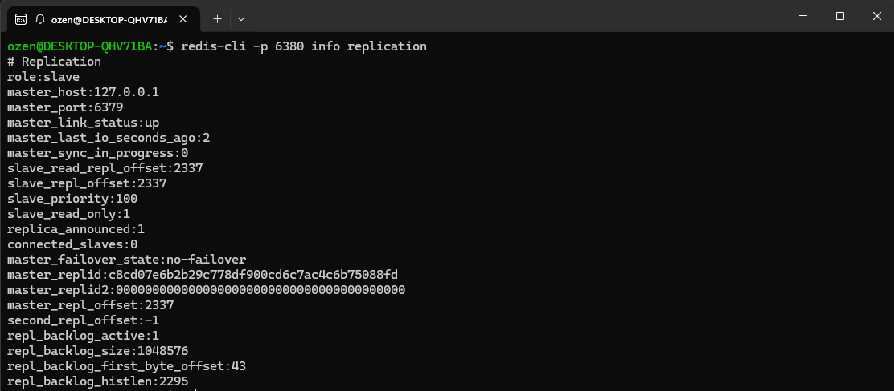
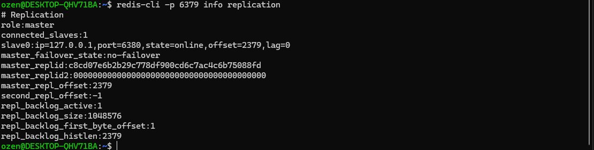

# Projet Redis

Tout d'abord on va installer ubuntu via wsl pour simuler une vm sur windows pour y installer tout ce que l'on veut dessus.

Sur cette machine on y installe redis
```shell
sudo apt install redis-server
```
Et on vérifie qu'il fonctionne 
```shell
redis-cli ping
```
On duplique le fichier conf pour le slave
```shell
cp /etc/redis/redis.conf ~/redis-slave.conf
```
Et on le modifie pour y ajouter un port et le port vers son master
```shell
port 6380
replicaof 127.0.0.1 6379
```
On lance les 2 serveurs
```shell
# Master
redis-server /etc/redis/redis.conf

# Slave
redis-server ~/redis-slave.conf
```

On vérifie la réplication
```shell
redis-cli -p 6380 info replication
redis-cli -p 6379 info replication
```




Ensuite on code l'api en python en utilisant flask

```py
from flask import Flask, jsonify
import redis
import time

app = Flask(__name__)

redis_host = "localhost"
r = redis.Redis(host=redis_host, port=6379, decode_responses=True)

@app.route('/data/<key>')
def get_data(key):
    cached = r.get(key)
    if cached:
        return jsonify({'data': cached, 'source': 'cache'})

    time.sleep(2)
    value = f"Valeur générée pour {key}"
    r.setex(key, 60, value)
    return jsonify({'data': value, 'source': 'slow source'})

if __name__ == '__main__':
    app.run(debug=True)
```

On lance l'appli et on va vérifier en local que ça fonctionne
http://127.0.0.1:5000/data/test

Lors de la première ouverture du lien 

```json
{
  "data": "Valeur générée pour test",
  "source": "slow source"
}
```
et lors de la deuxième
```json
{
  "data": "Valeur générée pour test",
  "source": "cache"
}
```